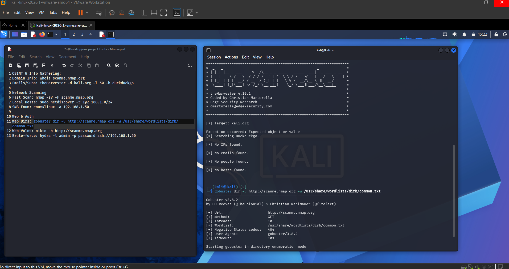

# Kali Linux Reconnaissance & Enumeration Lab

A hands-on lab executing network reconnaissance, OSINT, and vulnerability enumeration using a virtualized Kali Linux environment.

## Execution Scope
Deployed industry-standard tools against authorized training environments to map network topologies, discover exposed assets, and identify initial attack vectors.

## Tool Arsenal

### 1. OSINT & Info Gathering
* **whois:** Domain registration data extraction.
* **theHarvester:** Email and subdomain scraping via public search engines.

### 2. Network Scanning
* **Nmap:** Fast TCP port scanning and service version detection.
* **Netdiscover:** ARP-based local subnet host discovery.
* **Enum4linux:** SMB and Windows service enumeration.

### 3. Web & Auth
* **Gobuster:** Dictionary-based web directory fuzzing.
* **Nikto:** Web server configuration and vulnerability scanning.
* **Hydra:** Protocol-level authentication testing (Brute-force).

## Proof of Execution
