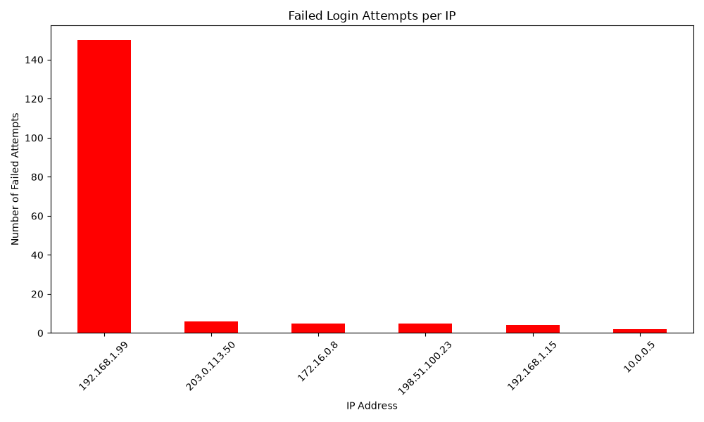

# Server Log Analysis (Data Engineering & Analysis)

An end-to-end data analysis pipeline demonstrating the extraction, transformation, and visualization of server logs to detect security threats.

## Architecture
1. **Data Generation:** Simulated standard server traffic and a targeted brute-force attack using a Python script.
2. **Data Parsing:** Parsed unstructured raw text logs into a structured format.
3. **Data Analysis:** Utilized `pandas` to aggregate data and identify anomalous patterns (high frequency of 401 unauthorized errors).
4. **Data Visualization:** Used `matplotlib` to generate graphical reports of the threat analysis.
## Analysis Result

  

## Core Skills Demonstrated
* Unstructured data parsing.
* Data transformation and aggregation (Pandas).
* Threat detection (Anomaly detection).
* Data visualization (Matplotlib).
